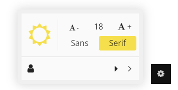

修改自项目：[YoduBGM](https://github.com/TwinIsland/YoduBGM)，更好的兼容**VOID**主题

**使用**

正常上传+启用插件，然后用[`footer_part.php`](footer_part.php)替换掉主题文件夹`footer.php`对应的位置（**不是全部替换！！**），[`void_part.css`](void_part.css)同理，替换原主题主样式表对应位置
